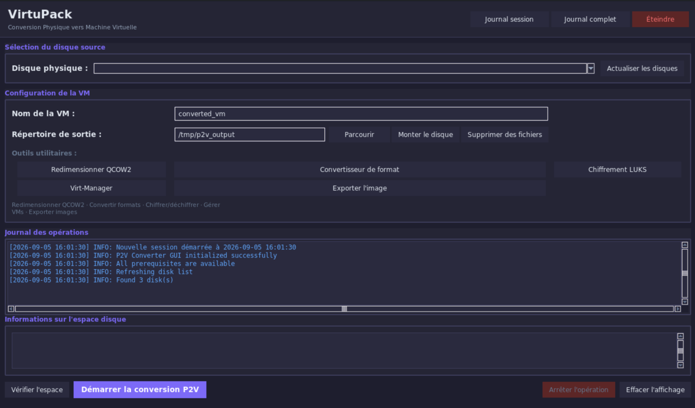
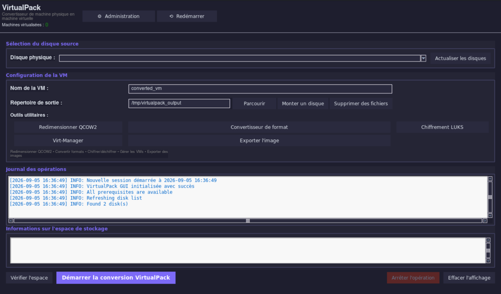

# VirtuPack – Transformer des machines physiques en machines virtuelles

Transformez des disques physiques en images de machine virtuelle **qcow2** prêtes à être utilisées sur n’importe quel hyperviseur. Outil axé sur la sécurité, avec une interface graphique intuitive, empêchant l’imagerie accidentelle de systèmes en cours d’exécution. Créez une **ISO amorçable** pour convertir hors ligne et en toute sécurité n’importe quelle machine physique.

***

## Fonctionnalités

### Conversion principale
- Convertit des disques physiques en images **qcow2 compressées**.
- Suivi de progression en temps réel avec possibilité d’annulation.
- Bloque la conversion des disques système actifs et des partitions montées.
- Analyse intelligente de l’espace basée sur l’utilisation réelle.
- Journalisation complète dans `/var/log/virtupack.log`.

### Outils avancés
- **Redimensionnement QCOW2** : optimise la taille du disque virtuel.
- **Convertisseur de format** : conversion entre qcow2, vmdk, vdi, vpc, vhdx et raw.
- **Chiffrement LUKS** : sécurise les VM avec des conteneurs protégés par mot de passe.
- **Gestionnaire d’export** : transfert des images via RSYNC.
- **Gestionnaire de fichiers** : nettoyage de l’espace de travail.
- **Intégration avec Virt-Manager** : gestion directe des VM.
- **Prise en charge du stockage externe** : montage et utilisation de disques externes.

### Systèmes d’exploitation pris en charge
- **Windows** (toutes les versions, de XP à 11, éditions serveur).
- **Linux** (toutes les distributions : Ubuntu, Debian, Fedora, CentOS, Arch, etc.).

***

## Mode Live vs mode Installateur

L’ISO 64 bits précompilée intègre deux modes de démarrage.

### Mode Live
Le mode Live est conseillé lorsqu’on virtualise une machine en démarrant directement sur le système cible via une clé USB bootable contenant l’ISO. Le processus de virtualisation s’exécute entièrement depuis l’environnement Live, sans aucune installation requise sur la machine hôte.

Les utilisateurs ont accès à toutes les fonctionnalités, y compris la possibilité d’exporter les journaux vers un support de stockage externe avant d’éteindre la session.

<div style="display: flex; align-items: center;">
  
</div>

### Mode Installateur
Le mode Installateur est conçu pour une **station fixe de virtualisation**, où les disques physiques retirés de leurs machines d’origine sont directement connectés à la station pour être virtualisés. Ce mode vise une configuration permanente et dédiée, plutôt qu’une intervention sur site.

Toutes les fonctionnalités sont disponibles pour l’utilisateur, à l’exception des opérations suivantes, qui sont **réservées à l’accès administrateur (protégé par mot de passe)** :

| Action protégée | Raison |
|---|---|
| Export des journaux depuis la station | Empêcher l’extraction non autorisée de données |
| Purge des journaux | Préserver l’intégrité de la trace d’audit |
| Redémarrage et arrêt du système | Garantir la disponibilité de la station |
| Quitter le mode kiosque | Maintenir un environnement contrôlé |

<div style="display: flex; align-items: center;">
  
</div>

### Comparaison rapide

| | Mode Live | Mode Installateur |
|---|---|---|
| **Cas d’usage** | Intervention sur site, démarrage sur la machine cible | Station fixe, connexion de disques externes |
| **Installation requise** | Non | Oui |
| **Export des journaux** | ✅ Utilisateur | 🔒 Administrateur uniquement |
| **Purge des journaux** | ✅ Utilisateur | 🔒 Administrateur uniquement |
| **Redémarrage / arrêt** | ✅ Utilisateur | 🔒 Administrateur uniquement |
| **Quitter le mode kiosque** | ✅ Utilisateur | 🔒 Administrateur uniquement |
| **Virtualiser un disque** | ✅ Utilisateur | ✅ Utilisateur |
| **Redimensionner le système de fichiers de la VM** | ✅ Utilisateur | ✅ Utilisateur |
| **Convertir le format de l’image VM** | ✅ Utilisateur | ✅ Utilisateur |
| **Chiffrer l’image VM** | ✅ Utilisateur | ✅ Utilisateur |
| **Démarrer la VM sur Qemu** | ✅ Utilisateur | ✅ Utilisateur |

## Démarrage rapide

### Télécharger l’ISO précompilée (recommandé)
**[Télécharger l’ISO VirtuPack](https://archive.org/details/virtu-pack-v-3.1)**

```txt
- VirtuPack-v3.1-64bits.iso : 12ead32db4d9bd5d0f6ea7592eca821fdc8d3668ef2890fd5675e8226e59a147
- VirtuPack-v3.1-32bits.iso : ec69e8cd86e3fc8cce7d7df5f41cdbc6769aa7a22ce9bae9bf13e161025fd849
```

Choisissez la version d’ISO souhaitée : 32 bits ou 64 bits.

### Ou créer votre propre ISO

```bash
cd iso/
make  # environnement 64 bits
make 32  # environnement 32 bits
make all-iso # génère les 2 ISO
make clean   # nettoie les fichiers de build
make help    # affiche le message d’aide
```

***

## Prérequis

### Méthode ISO (recommandée - sans configuration)
- Clé USB (8 Go ou plus) ou DVD.
- Disque de stockage externe pour la sortie.
- Aucune configuration supplémentaire nécessaire.

### Installation native

**Ubuntu/Debian :**
```bash
sudo apt install qemu-utils python3-tk gparted rsync cryptsetup virt-manager libvirt-daemon-system
```

**Fedora/CentOS/RHEL :**
```bash
sudo dnf install qemu-img python3-tkinter gparted rsync cryptsetup virt-manager libvirt
```

**⚠️ Critique pour le stockage externe :** configurez libvirt pour accéder aux disques externes :

```bash
sudo nano /etc/libvirt/qemu.conf

# Ajouter/modifier ces lignes :
user = "root"
group = "root"

cgroup_device_acl = [
    "/dev/null", "/dev/full", "/dev/zero",
    "/dev/random", "/dev/urandom",
    "/dev/ptmx", "/dev/kvm",
    "/dev/rtc", "/dev/hpet",
    "/dev/sdb", "/dev/sdc", "/dev/sdd",  # Vos disques externes
    "/dev/disk/by-uuid/*"
]
```

```bash
sudo systemctl restart libvirtd
sudo usermod -a -G libvirt $USER
```

## Flux d’utilisation

### 1. Démarrer depuis l’ISO
- Écrire l’ISO sur une clé USB : `sudo dd if=virtupack*.iso of=/dev/sdX bs=4M status=progress` (ou utiliser une [clé Ventoy](https://www.ventoy.net/en/)).
- Démarrer la machine cible sur la clé USB.

### 2. Connecter le stockage externe
- Brancher un disque USB externe (ne pas le monter manuellement).

**Monter le stockage externe :**
- Cliquer sur le bouton **"Mount Disk"**.
- Sélectionner votre disque externe.
- Cliquer sur **"Mount Selected Disk"**.
- Le dossier de sortie se met à jour automatiquement.

### 3. Configurer la conversion

**Sélectionner la source :**
- Cliquer sur **"Refresh Disks"**.
- Sélectionner le disque à convertir (les disques système sont bloqués pour des raisons de sécurité).

**Vérifier l’espace :**
- Cliquer sur **"Check Space Requirements"**.
- Indicateur vert = espace suffisant.

### 4. Convertir
- Cliquer sur **"Start P2V Conversion"**.
- Suivre la progression (annulation possible à tout moment si besoin).
- Durée typique : 30 à 120 minutes selon la taille et le système.

### 5. Post-traitement optionnel
- **"QCOW2 Resize"** : optimise la taille du disque (modifie la taille du système de fichiers, réduit la taille virtuelle et compresse l’image virtuelle).
- **"LUKS Encryption"** : sécurise avec un mot de passe.
- **"Format Converter"** : convertit en VMDK/VDI/VHD.
- **"Export Image"** : transfert via RSYNC.
- **"Print Session Log"** : génère un rapport PDF.

***

## Exécution des VM converties

### Avec virt-manager

```bash
# Depuis l’ISO (auto-configuré) ou une installation native :
virt-manager... # Puis dans l’interface :
# 1. Nouvelle VM → Importer un disque existant
# 2. Parcourir jusqu’au fichier .qcow2
# 3. Choisir le type d’OS (Windows ou Linux)
# 4. Choisir le firmware :
#    - UEFI pour les systèmes modernes (2010+)
#    - BIOS pour les systèmes plus anciens
# 5. DÉSACTIVER Secure Boot
# 6. Démarrer la VM
```

### Avec la CLI QEMU

**Démarrage BIOS :**
```bash
qemu-system-x86_64 -m 4096 -drive file=vm.qcow2,format=qcow2 -enable-kvm
```

**Démarrage UEFI :**
```bash
qemu-system-x86_64 -m 4096 \
  -drive file=vm.qcow2,format=qcow2 \
  -drive if=pflash,format=raw,readonly=on,file=/usr/share/OVMF/OVMF_CODE.fd \
  -enable-kvm
```

**Depuis un disque externe :**
```bash
sudo mount /dev/sdb1 /mnt/external
qemu-system-x86_64 -m 4096 -drive file=/mnt/external/vm.qcow2,format=qcow2 -enable-kvm
```

***

## Conversion de format

| Plateforme | Format | Commande |
|----------|--------|---------|
| VMware | vmdk | `qemu-img convert -f qcow2 -O vmdk src.qcow2 output.vmdk` |
| VirtualBox | vdi | `qemu-img convert -f qcow2 -O vdi src.qcow2 output.vdi` |
| Hyper-V | vhdx | `qemu-img convert -f qcow2 -O vhdx src.qcow2 output.vhdx` |
| Générique | raw | `qemu-img convert -f qcow2 -O raw src.qcow2 output.img` |

Ou utilisez l’outil graphique **"Format Converter"**.

***

## Dépannage

### Problèmes courants
**"Disk Unavailable"**
- Démarrez depuis l’ISO pour convertir les disques système.
- Démontez les partitions : `sudo umount /dev/sdX1`

**"Insufficient Space"**
- Utilisez **"Mount Disk"** avec un disque externe plus grand.
- Vérifiez que l’espace disponible correspond à l’espace requis.

**"Cannot Mount External Drive"**
- Vérifiez la détection : `lsblk`
- Démontez si le disque est déjà monté : `sudo umount /dev/sdX1`

**"VM Won't Boot"**
- Essayez les modes UEFI et BIOS.
- Désactivez Secure Boot.
- Windows peut nécessiter une réactivation après conversion.

**"Permission Denied" (installation native)**
- Configurez libvirt comme indiqué dans les prérequis.
- Ou lancez avec : `sudo python3 code/main.py`

**"External Drive VM Fails to Start"**
- Installation native : configurez `cgroup_device_acl` de libvirt.
- Méthode ISO : aucune configuration requise.

### Problèmes spécifiques à Windows

**"Windows requires activation"**
- Comportement normal après un changement matériel.
- Utilisez la clé produit d’origine pour réactiver ou la commande **slmgr /rearm**.

**"Missing drivers after boot"**
- Installez les pilotes virtio dans la machine invitée.
- Ou utilisez le mode disque IDE dans les paramètres de la VM.

**"BSOD on first boot"**
- Utilisez le mode BIOS au lieu de l’UEFI.
- Désactivez virtio et utilisez d’abord IDE.

### Journaux

Consultez `/var/log/virtupack.log` pour obtenir des diagnostics détaillés, ou utilisez **"Print Session Log"** pour générer des rapports PDF.

***

## Structure du projet

```text
virtupack/
├── code/                          # Application
│   ├── main.py                    # Point d’entrée
│   ├── p2v_dialog.py              # Interface graphique principale
│   ├── vm.py                      # Moteur de conversion
│   ├── utils.py                   # Utilitaires disque
│   ├── log_handler.py             # Journalisation et PDF
│   ├── disk_mount_dialog.py       # Gestionnaire de montage
│   ├── qcow2_resize_dialog.py     # Outil de redimensionnement
│   ├── image_format_converter.py  # Convertisseur de format
│   ├── ciphering.py               # Chiffrement LUKS
│   ├── export.py                  # Export RSYNC
│   └── virt_launcher.py           # Gestion des VM
├── iso/                           # Générateurs d’ISO
│   ├── forgeIsoKde.sh             # ISO KDE 64 bits
│   ├── forgeIsoXfce.sh            # ISO XFCE 64 bits
│   ├── forgeIsoKde32.sh           # ISO KDE 32 bits
│   ├── forgeIsoXfc32e.sh          # ISO XFCE 32 bits
│   └── makefile                   # Automatisation du build
└── README.md
```

## Bonnes pratiques

✅ Utilisez la méthode ISO pour des conversions sûres.  
✅ Utilisez des disques externes USB 3.0 ou plus pour de meilleures performances.  
✅ Créez une sauvegarde avant de redimensionner les partitions à l’aide du bouton **Backup**.  
✅ Conservez le disque source intact jusqu’à validation complète de la VM.  
✅ Utilisez le chiffrement LUKS pour les systèmes sensibles.  
✅ Générez des journaux PDF pour la documentation.  

## Détails techniques

- **Format** : QCOW2 avec compression zlib.
- **Systèmes source pris en charge** : Windows et Linux, quel que soit le système de fichiers.
- **Emplacement des journaux** : `/var/log/virtupack.log`.
- **Interface graphique** : Python 3 + Tkinter.
- **Outils** : qemu-img, cryptsetup, rsync, libvirt, virt-manager, qemu-utils.
- **Plateformes cibles** : QEMU/KVM, VirtualBox, VMware, Hyper-V.

## Exemple rapide

```bash
# 1. Démarrer depuis l’ISO → lancer VirtuPack
# 2. Cliquer sur "Refresh Disks" → sélectionner /dev/sda (disque Windows)
# 3. Cliquer sur "Mount Disk" → sélectionner le disque externe /dev/sdb1 → monter dans /mnt/external
# 4. Cliquer sur "Check Space Requirements" → vérifier l’indicateur vert
# 5. Cliquer sur "Start P2V Conversion" → attendre environ 45 min pour un disque de 250 Go
# 6. Cliquer sur "Print Session Log" → enregistrer le rapport PDF
# 7. Transférer le disque externe vers le système hôte
# 8. Exécuter : qemu-system-x86_64 -m 4096 -drive file=/mnt/external/sda_vm.qcow2 -enable-kvm
```

**Systèmes pris en charge :**
- Windows (XP, Vista, 7, 8, 10, 11, Server 2003-2022)
- Linux (Ubuntu, Debian, Fedora, CentOS, RHEL, Arch, openSUSE, etc.)

## Licence

Attribution-NonCommercial-ShareAlike 4.0 International. Voir le fichier LICENSE.

---

**Transformez n’importe quelle machine physique Windows ou Linux en environnement virtuel portable.**
